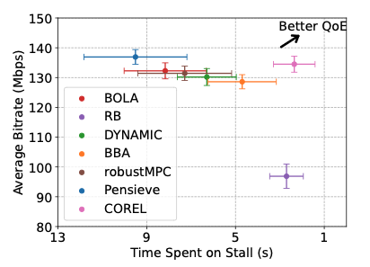

# COREL
Tensorflow Implementation of [COREL: Constrained Reinforcement Learning for Video Streaming ABR Algorithm Design over mmWave 5G](https://ieeexplore.ieee.org/abstract/document/10317803?casa_token=1OExhLOk958AAAAA:0qHVFYP8Spyfp12DgjsuJFp6wL21lElOjhk8rvanj2PhRea6UhuyJaBwMjgp85oH1iZIzWa8tg), published in IEEE CQR 2023. 

The implementation is built upon [Pensieve](https://github.com/hongzimao/pensieve/tree/master), an A3C RL-based ABR algorithm. Different from Pensieve, COREL is a `primal-dual-based RL` ABR algorithm, tailored for dynmaic and wild 5G netowrks. 

The fast changing 5G throughput is an exogenous and stochastic process independent of ABR actions, making it challenging for RL to evaluate ABR decisions, as observed QoE feedback may vary due to disparate network conditions or the quality of the learned policy. COREL copes with 5G networks by `reward shaping` and casts the ABR algorithm optimization as a `constrained optimization` task: optimizing a single objective (i.e., maximizing bitrate ) while maintaining a controlled level of performance degradation in other objectives (i.e., minimizing stall time to satisfy a constraint).

Results across various commercial mmWave 5G traces show that COREL reduces the average stall time by a factor of 4.


## Prerequisites
- Install prerequisites (tested with Ubuntu 16.04, Tensorflow v1.1.0, TFLearn v0.3.1 and Selenium v2.39.0)
```
python setup.py
```
- 5G network traces: unzip files in [traces](https://github.com/COREL-ABR/COREL/tree/main/traces).
- Video traces: use `ffmpeg` and `MP4Box` to compress any raw video and get its chunk sizes. See instructions in [get_dash_chunk_size](https://github.com/COREL-ABR/COREL/tree/main/get_dash_chunk_size).

### Training
- To train a new model, put training data in `sim/cooked_traces` and testing data in `sim/cooked_test_traces`, then copy `video_size_*` from `get_dash_chunk_size` to `sim/`, run
```
python constrained_multi_agent_future.py
```

### Testing
- To test the trained model in simulated environment, copy `video_size_*` from `get_dash_chunk_size` to `test/`, then run 
```
python rl_no_training_constrained_future.py
```
Similar testing can be performed for buffer-based approach (`bb.py`), mpc (`mpc.py`) and offline-optimal (`dp.cc`) in simulations.

If you find this work useful for your research, please cite:
```bibtex
@inproceedings{hu2023corel,
  title={COREL: Constrained Reinforcement Learning for Video Streaming ABR Algorithm Design Over mmWave 5G},
  author={Hu, Xinyue and Ghosh, Arnob and Liu, Xin and Zhang, Zhi-Li and Shroff, Ness},
  booktitle={2023 IEEE International Workshop Technical Committee on Communications Quality and Reliability (CQR)},
  pages={1--6},
  year={2023},
  organization={IEEE}
}
